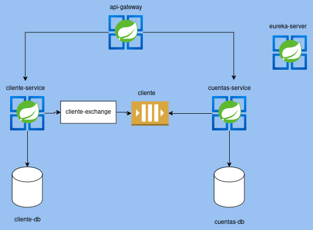

# SISTEMA DE MICROSERVICIOS



## Modules
* **cliente-service**:
  This services provides REST API for managing clients and publishes clients events to the message broker.

  **TechStack:** Spring Boot, Spring Data JPA, PostgreSQL


* **cuentas-service**:
  This service provides the REST API for managing cuentas and movimientos, consumes clients events before be able to create an account.

  **TechStack:** Spring Boot, Spring Data JPA, PostgreSQL


* **api-gateway**:
  This service is an API Gateway to the internal backend services (cliente-service, cuentas-service).

  **TechStack:** Spring Boot, Spring Cloud Gateway


* **eureka-server**:
  This service is a service registry to the internal backend services.

  **TechStack:** Spring Boot, Spring Cloud Gateway.

## Documentation

* **cliente-ddl.sql**:
Cliente database DDL definition


* **cuentas-ddl.sql**:
Cuentas database DDL definition


* **sistema-microservicios gateway.postman_collection.json**:
Postmant endpoint definition

## Local Deployment

The all project is defined as container elements to be used directly from the docker compose
file, the RabbitMQ queue is defined as an external service from [cloud-amqp](https://www.cloudamqp.com/),
every other service is ready to be deployed locally from the docker images from docker hub.

Before running the docker compose file it necessary to add the .env file with the excepted values

To run the solution
```dockerignore
docker-compose up
```

The cliente-service creates a client and pubish an event to the cliente exchange and then stored
the event and the client on the cliente-db. There is a job that reads the client-events table that pubish
a new entry to the exchange every minute.


The cuentas-service reads the cliente queue and stores the event on the cliente events table,
a new account can be created using a name from the clients that are already created in the cliente-service

The movements are asociated to an account, and every account can have one ore more movements

